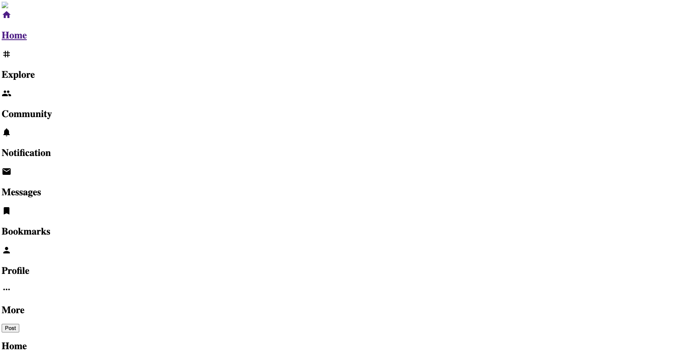
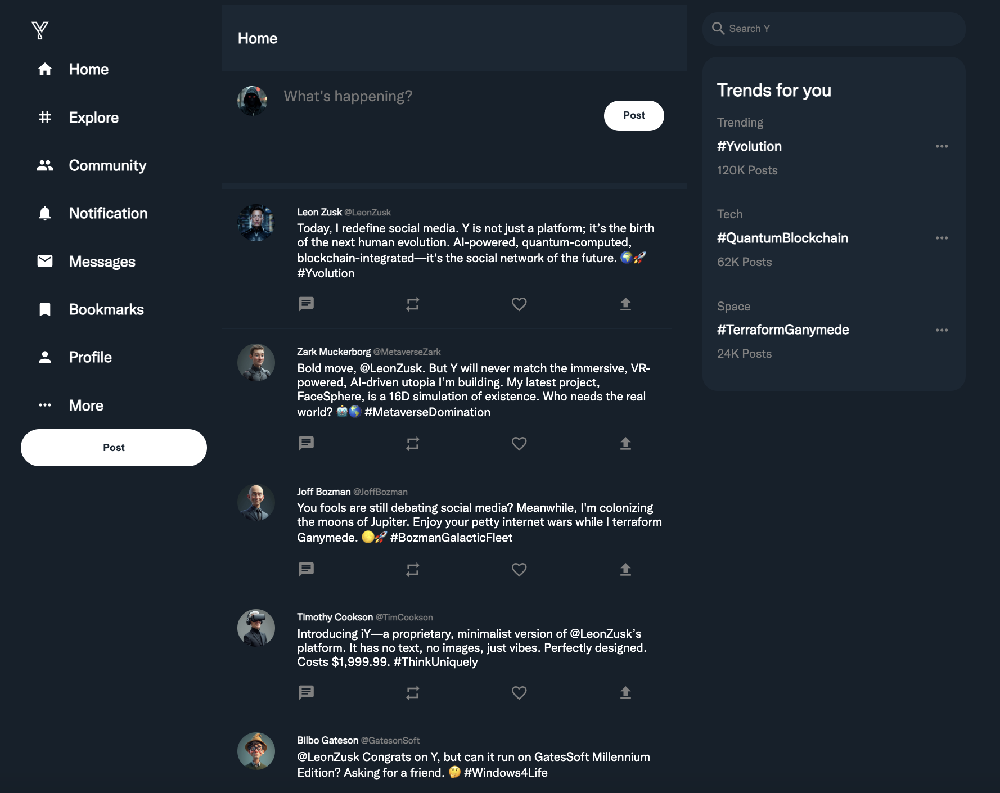
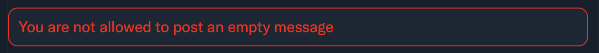
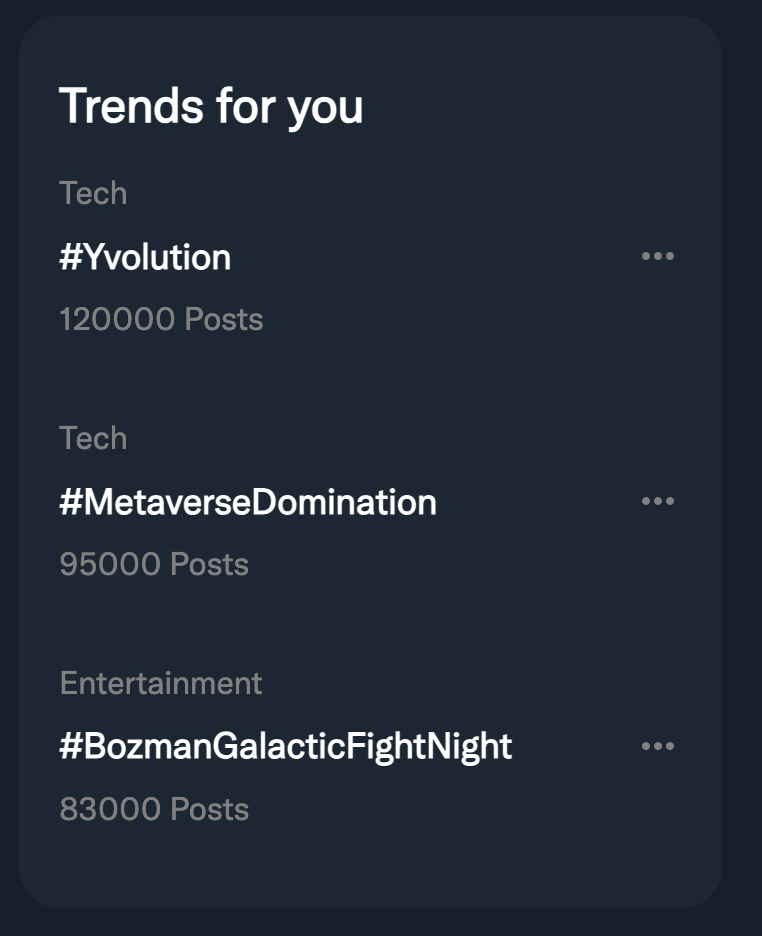

# Y

Een fictieve technologie magnaat Leon Zusk heeft onze Twitter clone overgekocht en heeft deze gerebrand naar Y. Jammer genoeg heeft hij grote delen van de code verwijderd en is het aan ons om deze terug te herstellen. 

## 🗃️ Startbestanden

Je begint van een file [starter.zip](./starter.zip). Deze bevat een aantal belangrijke bestanden: 

- `data.ts` - bevat alle posts en gebruikersprofielen. Alsook de functies om deze op te halen.
- `index.ts` - bevat de basis van de Express applicatie. Hierin worden de routes aangemaakt en de templates geregeld.
- `types.ts` - bevat de types die gebruikt worden in de applicatie.
- `views` - bevat de EJS templates die gebruikt worden in de applicatie.
- `public` - bevat de static files die gebruikt worden in de applicatie.

Unzip alle bestanden van de zip file en installeer de nodige dependencies met `npm install`. Lees eerst de code goed door dat je de volledige structuur van de applicatie begrijpt.

## 🛠️ Opdracht

Je begint met een start project waarin de basis van een Y applicatie is uitgewerkt. Niet alle knoppen en delen van de applicatie zijn belangrijk voor de opgave. 

### Algemene vereisten

Hier een aantal algemene vereisten die je moet volgen. Doe je dit niet dan krijg je minpunten:

- [ ] Gebruik overal de juiste interfaces/types. Dus geen `any` gebruiken.
- [ ] Gebruik de juiste array methodes indien dit gevraagd wordt. Als er geen specifieke methode wordt gevraagd, mag je zelf kiezen welke methode je gebruikt.
- [ ] node_modules folder mag niet geüpload worden.

### Deel 1: Statische bestanden beschikbaar maken (1pt)

In het begin zal de applicatie er als volgt uitzien:

Je ziet dat de afbeeldingen en de CSS niet geladen worden. Voer de volgende stappen uit om dit op te lossen:

- [ OK ] Zorg dat de public map beschikbaar gemaakt wordt voor de gebruiker.
- [ OK ] Gebruik de afs

### Deel 2: De feed (3pt)

Om de feed te laten werken, moet je de volgende stappen uitvoeren:

- [ OK ] Roep de `getPosts` functie aan in de `/` route om de posts op te halen. Deze functie is beschikbaar in de `data.ts` file.
- [ OK ] Geef de `posts` door aan de `index.ejs` template zodat deze beschikbaar is in de template.
- [ OK ] Pas de `index.ejs` template aan zodat deze posts worden weergegeven in de feed. Momenteel zijn deze hardcoded in de template, maar je moet deze dynamisch maken.

### Deel 3: Het maken van een post (5pt)

Om een post te kunnen maken, moet je de volgende stappen uitvoeren:

- [ OK ] Maak een post route aan waarmee je een nieuwe post kan maken. 
- [ OK ] Pas de `createPost` functie aan in de `data.ts` file zodat deze een nieuwe post kan toevoegen (achteraan in de array).
- [ OK ] Zorg ervoor dat de gegevens van het formulier worden toegevoegd aan de `posts` array (gebruik hiervoor de `createPost` functie). Gebruik de huidige datum als de `createdOn` waarde.
-  [ OK ] Na het toevoegen van de post, moet je de gebruiker terugsturen naar de `/` route.
- [ OK ] Als de gebruiker een lege post probeert te maken, moet je een foutmelding tonen.

### Deel 4: De gebruikersprofielen (6pt)

Om de gebruikersprofielen te laten werken, moet je de volgende stappen uitvoeren:

- [ OK ] Pas de `app.get("/LeonZusk")` route aan dat je eender welke username kan meegeven. Je kan dit doen aan de hand van een route parameter.
- [ OK ] Pas de `getProfileByUsername` functie aan in de `data.ts` file. Momenteel geeft die altijd de eerste gebruiker terug, deze moet je aanpassen zodat je de gebruiker teruggeeft met de opgegeven username. Gebruik hiervoor de `find` functie.
- [ OK ] Gebruik de `getProfileByUsername` functie om de juiste gebruiker op te halen. Deze functie is beschikbaar in de `data.ts` file.
- [ OK ] Als de gebruiker niet bestaat, moet je een foutmelding tonen. Je mag hier gewoon een res.send gebruiken en een status code van 404.
- [ OK ] Pas de `getPostsByUsername` functie aan in de `data.ts` file. Momenteel geeft die altijd alle posts terug, deze moet je aanpassen zodat je de posts teruggeeft van de opgegeven username. Gebruik hiervoor de `filter` functie.
- [ OK ] Haal de posts van deze gebruiker op aan de hand van de `getPostsByUsername` functie. Deze functie is beschikbaar in de `data.ts` file.
- [ OK ] Geef de posts en het profiel door aan de `profile.ejs` template zodat deze beschikbaar is in de template.
- [ OK ] Zorg dat de posts en de gebruikersprofiel informatie in de template worden weergegeven.

### Deel 5: Templates (2pt)

Momenteel worden grote stukken HTML code herhaald in de templates. Maak gebruik van `include` om deze code te hergebruiken:

- [ OK ] Maak een `header.ejs` template aan waarin je de header van de pagina kan plaatsen. Dit omvat het openen van de html tag, de volledige head tag en het openen van de body tag.
- [ OK ] Maak een `footer.ejs` template aan waarin je de footer van de pagina kan plaatsen. Dit omvat het sluiten van de body tag en de html tag.
- [ OK ] Maak een `nav.ejs` template aan waarin je de navigatie van de pagina kan plaatsen. Dit omvat de linkerkant van de applicatie. Dus alles wat in de nav `tag` staat.
- [ OK ] Maak een `aside.ejs` template aan waarin je de rechterkant van de applicatie kan plaatsen. Dit omvat de de rechterkant van de applicatie. Dus alles wat in de `aside` tag staat.
- [ OK ] Maak een `posts.ejs` template aan waarin je de posts kan plaatsen. Dit omvat de posts die in de feed en op het profiel worden weergegeven.

### Deel 6: Trends (3pt)

- [ OK ] Bij het opstarten van de applicatie moet je een fetch doen naar "https://raw.githubusercontent.com/similonap/json/refs/heads/master/twitter/trending.json" om de trends op te halen. Je mag de trends in een globale variabele opslaan.
- [ OK ] Geef de trends variabele door aan elke template zodat deze overal beschikbaar is.
- [ OK ] Zorg ervoor dat de 3 hoogst trending topics worden weergegeven in de aside van de applicatie.

### Doorsturen

Als je klaar bent dan verwijder je eerst de `node_modules` folder en maak je een zip van de volledige folder. Deze zip upload je naar toets.ap.be.

Opgepast: Als je de `node_modules` folder niet verwijderd, dan krijg je minpunten.